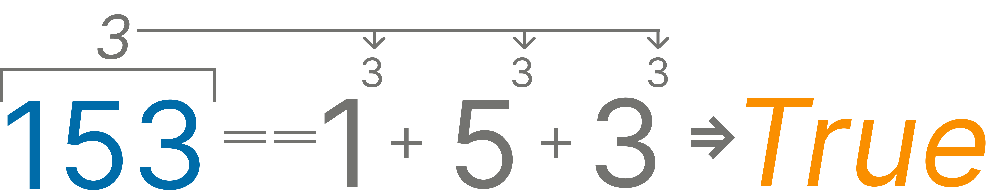

In number theory, an Armstrong number (after Michael F. Armstrong) or narcissistic number in a given number base (10 for this mission) is a number that is the sum of its own digits each raised to the power of the number of digits. 
For example, 153 is an Armstrong number because 1^3 + 5^3 + 3^3 == 153.

1^3 = 1
5^3 = 125
3^3 = 27

