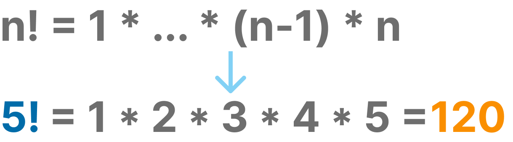

# Numbers with Exclamation

This function should take a non-negative integer as an input and return the factorial of that number. The factorial of a non-negative integer n is the product of all positive integers less than or equal to n .

## Definition, inputs/outputs, logic

*Definition*
- Whole number that is not negative
- Return factorial of *n*
    - the product of all numbers up to *n*

*Inputs and Outputs*
- Inputs: 5
- Outputs: 120 (1 x 2 x 3 x 4 x 5)

*Logics*
- For loop to handle each multiplication
- Store the result in a variable
- Return that variable

## Acknowledgements

 - [JS Checkio Mission](https://js.checkio.org/en/mission/number-with-exclamation/)

## License

[MIT](https://choosealicense.com/licenses/mit/)