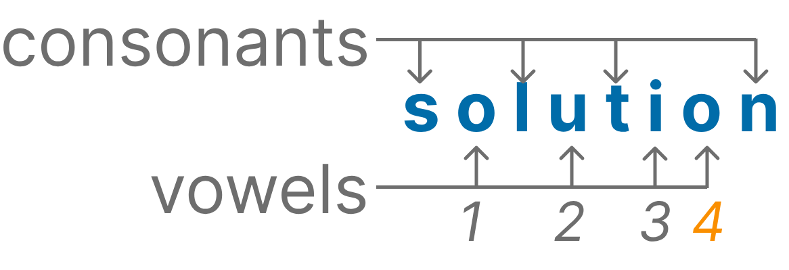

This function should take a string as an input and return the count of vowels (a, e, i, o, u) in the string. The function should be case-insensitive.



Examples

```js
countVowels("hello"); // 2
countVowels("openai") //4)
countVowels("typescript") //2)
countVowels("a") //1
```