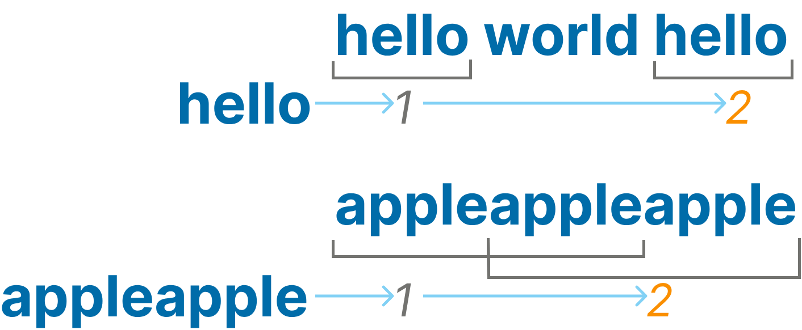

# Count Substring Occurrences

This function should take a main string and a substring as inputs and return the number of occurrences of the substring within the main string. It should not be case-sensitive and may overlap.

## Definition, inputs/outputs, logic

Input: Two strings (string).

Output: Integer (number).

## Acknowledgements

 - [JS Checkio Mission](https://js.checkio.org/en/mission/count-substring-occurrences/)

## License

[MIT](https://choosealicense.com/licenses/mit/)